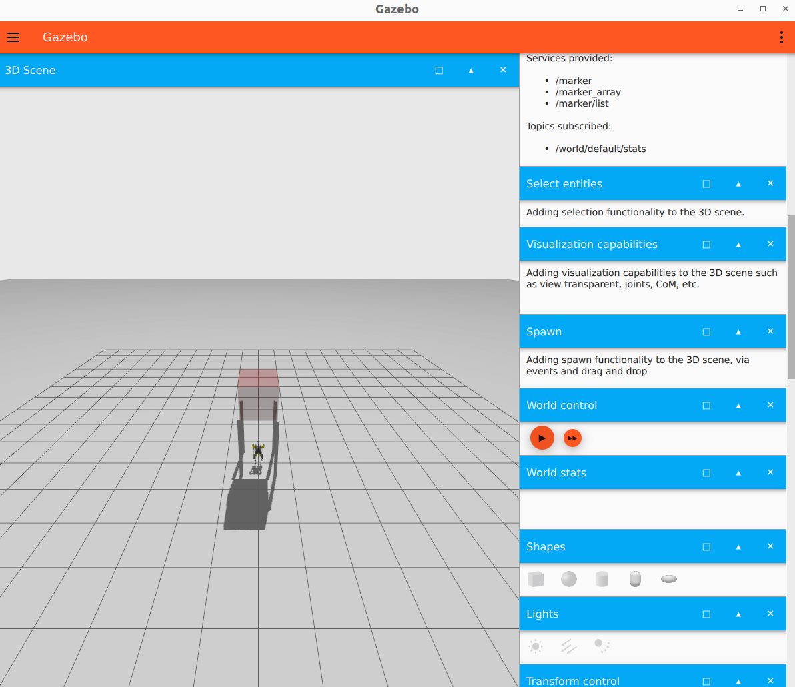

# Hector Gazebo Simulation with ROS 2 Humble and Ignition Fortress on Ubuntu 22.04

This guide outlines configuring and running the Hector Gazebo simulation with ROS 2 Humble Hawksbill and Ignition Fortress on Ubuntu 22.04.

## Prerequisites
* Ubuntu 22.04 LTS
* ROS 2 Humble Hawksbill installed (see [official ROS 2 Humble installation guide](https://docs.ros.org/en/humble/Installation.html) if needed).
* Git

## Installation and Configuration
### 1. Install Ignition Fortress and ROS 2 Integration
If Ignition Fortress is not already installed:
```bash
sudo apt update
sudo apt install ros-humble-ros-ign
```
*Note: Ensure your main ROS 2 setup file (e.g., *`/opt/ros/humble/setup.bash`*) is sourced in your shell environment (e.g., *`~/.bashrc`*).*

### 2. Clone and Build `hector_gazebo`
```bash
git clone https://github.com/hector-project/hector_gazebo.git
cd hector_gazebo
# Important: Do not rename CMakeLists.bak to CMakeLists.txt.
# This .bak file is for debugging; renaming it will cause build failure.
# You can safely delete CMakeLists.bak if preferred.
colcon build
```

### 3. Configure Gazebo Plugin Path
After a successful build, update the world file with the correct path to the `hector_gazebo_fortress_plugin`.
1.  Open the world file: `src/hector_gazebo/assets/models/worlds/world.sdf`
2.  Locate line **1921** (or search for `libhector_gazebo_fortress_plugin.so`). The line should look like this:
    ```xml
    <plugin name='hector_gazebo_plugins::HectorGazeboFortressPlugin' filename='/your/own/libhector_gazebo_fortress_plugin.so'>
    ```
3.  Modify the `filename` attribute to the absolute path of the compiled plugin. This path is typically:
    `<absolute_path_to_your_hector_gazebo_workspace>/install/hector_gazebo_fortress_plugin/lib/libhector_gazebo_fortress_plugin.so`
    Replace `/your/own/libhector_gazebo_fortress_plugin.so` with this actual path.
    For example, if your workspace is `/home/user/hector_gazebo`, the path would be `/home/user/hector_gazebo/install/hector_gazebo_fortress_plugin/lib/libhector_gazebo_fortress_plugin.so`.

## Running the Simulation
Follow these steps to launch and control the simulated robot.

### Step 0: Source Workspace Setup
**Important**: In every new terminal for this simulation, navigate to your `hector_gazebo` workspace directory (the `hector_gazebo` folder you cloned) and source the local setup file:
```bash
# Replace /path/to/your/hector_gazebo with the actual path
cd /path/to/your/hector_gazebo 
source install/setup.bash
```

### Step 1: Launch Gazebo Simulation
Open a new terminal (perform Step 0), then run:
```bash
ign gazebo /home/your_name/hector_gazebo/src/hector_gazebo/assets/models/worlds/world.sdf
```
#### !!!!!Replace /home/your_name/hector_gazebo/ with the actual absolute path to your hector_gazebo directory!!!!!

This opens the Ignition Fortress visualization. Wait for the world to load, then press the "play" button (right-pointing triangle icon) in the Gazebo GUI.

### Step 2: Run Hector Control Node
Open a new terminal (perform Step 0), then run:
```bash
ros2 launch hector_control control_launch.py
```
This node provides control inputs to the simulated robot.

### Step 3: Launch Keyboard Teleoperation (Optional)
To control the robot via keyboard, open a new terminal (perform Step 0), then run:
```bash
# Ensure this launch file exists in your setup or a related package
ros2 launch keyboard_joy keyboard_joy.launch.py
```
Once running, focus the terminal and use the configured keys (e.g., '1', '2', '3' - check `keyboard_joy.launch.py` for specifics) to control the robot. Observe movement in Gazebo.

### Step 4: Observe Autonomous Behavior (Example)
Behavior depends on the specific `hector_gazebo` world and plugin configurations.
* In the Gazebo window, press 'Q' (or other designated key per package documentation) to potentially trigger or observe autonomous actions.